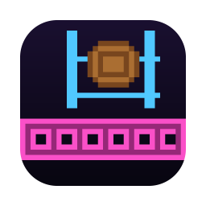
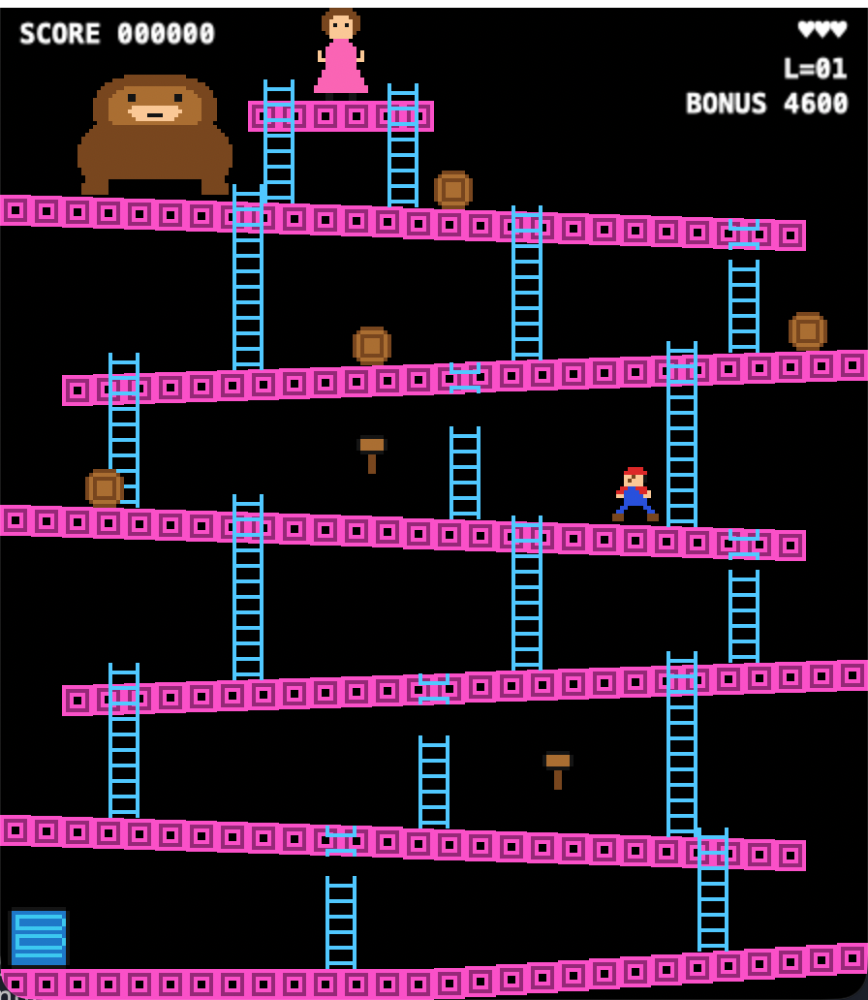

<div align="center">



# Barrel Climb

**An original arcade platformer for macOS and iOS — including the iPhone Duo, folded or open.**

[Play the pitch →](https://vincentlauriat.github.io/barrel-climb/) · [Report an issue](https://github.com/vincentlauriat/barrel-climb/issues)



</div>

---

Six sloping girders, a rain of barrels, two hammers and a rescue at the top. Climb before
the bonus runs out, then do it again — faster.

Barrel Climb borrows the *mechanics* of a 1981 arcade classic and nothing else. Every
sprite and sound in this repository is generated by a Python script you can read. No
Nintendo artwork, audio, level data or names appear anywhere in this project.

## Status

The **barrels stage** is complete and playable on both platforms. The three remaining
arcade stages are separate sub-projects, each with its own spec, plan and implementation
cycle.

- [x] Barrels — girders, ladders, barrels, fireballs, hammers, bonus timer, rescue, loop
- [ ] Pie factory
- [ ] Elevators
- [ ] Rivets

## Run it

You need **Xcode 27** and [XcodeGen](https://github.com/yonaskolb/XcodeGen)
(`brew install xcodegen`). No signing setup, no developer account.

```sh
git clone https://github.com/vincentlauriat/barrel-climb.git
cd barrel-climb
make run-mac
```

For the iPhone Simulator, `make build-ios` then install the built app:

```sh
xcrun simctl install booted build/DerivedData/Build/Products/Debug-iphonesimulator/DonkeyKong.app
xcrun simctl launch booted fr.lauriat.DonkeyKong
```

Running on your own iPhone means opening the generated `DonkeyKong.xcodeproj` in Xcode and
picking your team under Signing & Capabilities.

## Controls

| Action | Mac | Controller | iPhone / iPad |
|---|---|---|---|
| Walk, climb | Arrow keys or WASD | D-pad or left stick | Left pad |
| Jump, start | Space | A | Right button |

The touch overlay hides itself as soon as a controller connects.

## The rules that matter

- Barrels roll down every girder and pick a ladder at random. **Jump one** for 100 points;
  touch one and you lose a life. A ladder is no shelter.
- Two hammers hang on the way up. Nine seconds of swinging, 300 a barrel — but you can
  neither jump nor climb while you hold one.
- Every eighth barrel is blue. Let it reach the oil drum and a **fireball** climbs out to
  hunt you. Fireballs use ladders too.
- Five ladders are broken and stop halfway. You can start up them; you cannot get out.
- Reach the platform at the top before the bonus hits zero.

## How it is built

Two worlds, deliberately separated.

**`Core/` — the simulation.** A SwiftPM package (`DonkeyKongCore`) that imports no UI
framework, no clock, and no system random source. `World.step(input:dt:)` advances the
whole game by exactly 1/60 s from an input struct and a seeded random source, and returns
the list of things that happened. That purity is why all 76 tests run in hundredths of a
second with no simulator involved.

**`App/` — the screen.** One SpriteKit scene of 224 × 256 logical points mirrors the world
into sprite nodes after each step, and reacts to the returned events for sound and HUD.
`scaleMode = .aspectFit` is the entire foldable-phone story: the picture keeps its arcade
shape and letterboxes whatever is left, on any screen and either fold state.

One Xcode target serves macOS and iOS, generated by XcodeGen from `project.yml`.

## Commands

| Command | What it does |
|---|---|
| `make generate` | Regenerate `DonkeyKong.xcodeproj` from `project.yml` |
| `make test` | The 76 simulation tests — seconds, no simulator |
| `make build-mac` / `make build-ios` | Build each destination |
| `make run-mac` | Build and launch on this Mac |
| `make lint` | `swift format lint --strict` over `Core` and `App` |
| `make sprites` / `make sounds` / `make icon` | Regenerate the art, the audio, the app icon |

Run a single test with a regex over `Suite/test`:

```sh
swift test --package-path Core --filter DonkeyKongCoreTests.BarrelTests
swift test --package-path Core --filter 'barrelRollsDownSlopeUntilLadder'
```

## Layout

```
Core/Sources/DonkeyKongCore/    the simulation, grouped by concept
Core/Tests/                     mirrors the source file names
App/Sources/                    shared macOS + iOS SpriteKit code
App/Platform/{macOS,iOS}/       window, scene, keyboard, touch overlay
App/Resources/                  generated sprites, sounds and app icon
Tools/                          gen_sprites.py, gen_sounds.py, gen_icon.py — stdlib only
docs/                           the landing page and the design specs
```

Every speed, duration, score and probability lives in `Tuning.swift`. No rule inlines a
magic number.
